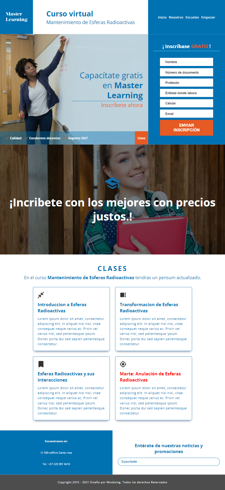

# **Prueba tecnica landin page** 🚀

Landing page creada para una prueba tecnica como maquetador web.

## **Demo** 🔍

[Ver el sitio Aquí](https://mooenz.github.io/prueba-tecnica-landin-page/)

## **Proyecto** 🧾

La prueba consiste en maquetar en HTML, el modelo que se encuentra a continuación, teniendo en cuenta las siguientes instrucciones:

- Maquetación en HTML (Relevancia: 35%)
- Diseñe el logo de la landing (Relevancia: (5%)
- Diseñe un banner que acompañe el formulario (Relevancia: 10%)
- Personalice los espacios de contenido y textos (Incluya los elementos que considere necesarios, sin alterar la estructura establecida) (Relevancia: 10%)
- Responsive Design (Relevancia: 40%)

## Overview

## Contacto 📧

- Linkedin [Mooenz](https://www.linkedin.com/in/mooenz/)
- Web Site [Curriculum Vitae](https://mooenz.github.io/curriculum-vitae/)

## Licence 🛸

This project is MIT licensed
